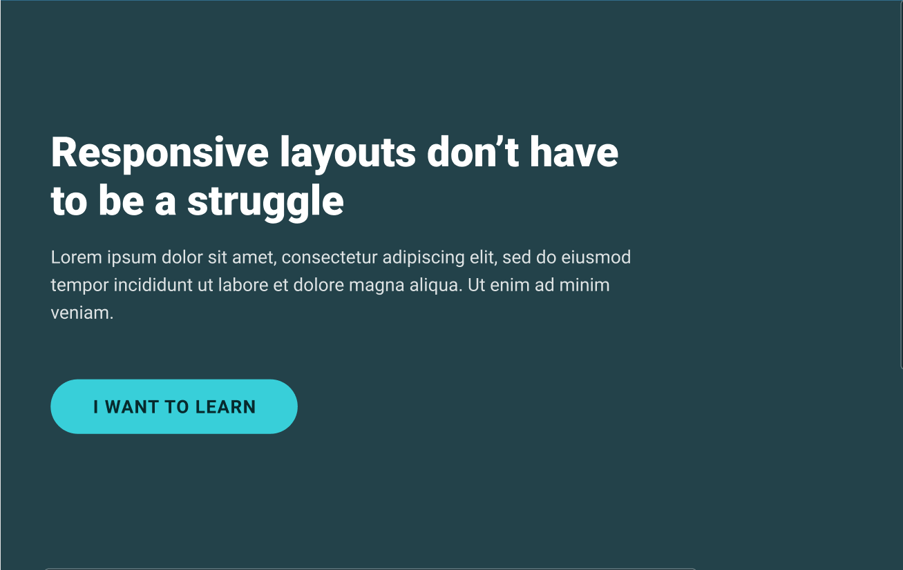

# Conquering-Responsive-Layouts

## Day 1

> Using percentages & avoiding heights

## Day 2

> Getting familiar with relative units

## Day 3

> Enter max-width

## Day 4
> Practice Time!

## Day 5
> Practice Time!

## Day 6
> Why you shouldn't use 'em's for font-size
> A Tale of width and max-width 

## Day 7
> Challenge 3 Solution
> 

## Day 8
> Flexbox Basics

## Day 9
> Deeper dive into Flexbox

## Day 10
> Flexbox Practice Time !
